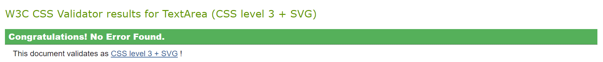

# Game: Rock, Paper, Scissors, Lizard, Spock

### [Live site](https://badralioui.github.io/rockPaperScissorLizardSpok/)

## Contents

- [Introduction](#introduction)
- [Design of the Website](#design)
  - [Fonts and Colours](#fonts)
- [Game Flow](#flow)
- [Technologies Used](#technologies)
  - [Languages](#languages)
  - [Frameworks, Libraries & Programs Used](#frameworks)
- [Testing](#testing)
  - [Validation](#validation)
  - [Browser Compatibility](#browser)
  - [Responsiveness](#responsiveness)
  - [Manual Testing](#manual_testing)
  - [Functional Testing](#functional_testing)
  - [Bugs](#bugs)
- [Deployment](#deployment)
- [Credits](#credits)
- [Acknowledgements](#acknowledgements)

## Introduction

A web-based version of "Rock, Paper, Scissors, Lizard, Spock" introduces two additional choices to the traditional game. This enhancement increases the strategy and fun, allowing players to compete against the computer and test their decision-making skills in this updated classic.

## Design of the Website

### Fonts and Colours

The website employs ["Rock salt"](https://fonts.google.com/selection/embed) for headings and ["Indie Flower"](https://fonts.google.com/selection/embed) for body text, creating a playful yet engaging aesthetic. The background color is #240A34, with text and other elements in colors like #EABE6C and #FFEDD8 to grab attention.

- 

Distinctive, appealing game icons and instructions image enhance the game's visual appeal and user experience.

- 
- 
- 
- 
- 
- 
- 

## Game Flow

The game logic and user interaction are designed to provide an intuitive and engaging experience, from the initial choice to the final outcome.

## Technologies Used

### Languages

- **HTML5**
- **CSS3**
- **JavaScript**

### Frameworks, Libraries & Programs Used

- Google Fonts for "Lobster" and "Indie Flower"
- Git for version control
- GitHub Pages for deployment

## Testing

### Validation

HTML and CSS files have been validated without significant issues.

#### HTML Validation

#### CSS Validation

#### Javascript

No significant issues were found

I got warnings

### Manual Testing

| Test Case                                 | Expected Outcome                                                  | Result |
|-------------------------------------------|-------------------------------------------------------------------|--------|
| Click on the "Play!" button               | The game area becomes visible, and the countdown starts.          | Pass   |
| Select a game choice (rock, paper, etc.)  | Player's choice is displayed; the computer makes a random choice; the game outcome is calculated. | Pass   |
| Game timer runs out                       | A modal appears indicating the game's outcome based on the scores and allows the game to be restarted. | Pass   |
| Restart the game after the game ends      | The game resets to the initial state with scores cleared, ready for a new session. | Pass   |

### Functional Testing

Functional testing verified the game logic for determining wins, losses, and draws according to the rules of "Rock, Paper, Scissors, Lizard, Spock":

| Player's Choice | Computer's Choice       | Expected Outcome | Result |
|-----------------|-------------------------|------------------|--------|
| Rock            | Scissors, Lizard        | Player Wins      | Pass   |
| Paper           | Rock, Spock             | Player Wins      | Pass   |
| Scissors        | Paper, Lizard           | Player Wins      | Pass   |
| Lizard          | Spock, Paper            | Player Wins      | Pass   |
| Spock           | Scissors, Rock          | Player Wins      | Pass   |
| Any             | Same as Player's Choice | Draw             | Pass   |
| Any             | Not covered by rules    | Computer Wins    | Pass   |

## Accessibility

Ensuring accessibility for all users is a cornerstone of "Game: Rock, Paper, Scissors, Lizard, Spock". Our platform was rigorously tested to guarantee an inclusive user experience, with exemplary scores in both desktop and mobile accessibility assessments.

- **Desktop Accessibility**:

- **Mobile Accessibility**:

### Browser Compatibility

Confirmed consistent and error-free user experience across Chrome, Firefox, and Edge.

### Responsiveness

Full responsiveness confirmed across devices of various sizes.

### Bugs & Fixes

During development and testing, a few issues were encountered and resolved:

1. **Issue:** Choice buttons remained active after game completion, allowing additional selections.
   - **Fix:** Deactivated choice buttons after the game ends until it is restarted.

2. **Issue:** Game did not properly reset scores and UI elements for a new game session.
   - **Fix:** Implemented a `resetGame()` function that properly resets all relevant game state and UI elements.

3. **Issue:** Timer continued running into negative numbers if not stopped manually.
   - **Fix:** Ensured the timer stops at 0 and triggers the end-of-game logic automatically.

## Deployment

The game is hosted on GitHub Pages. To deploy your own version:
1. Upload all necessary files to your GitHub repository.
2. Go to the repository's settings, navigate to the "Pages" section.
3. In the "Source" dropdown, select the main branch containing your project files.

The game is hosted on GitHub Pages. You can access the live site via the following link: [Game](https://badralioui.github.io/rockPaperScissorLizardSpok/)

## Credits

### Imagery
All images used on "The Review" website are sourced from [Google](https://www.google.com/search?sca_esv=28539f6bd3358b60&sca_upv=1&q=paper+scissors+rock+lizard+spock&uds=AMwkrPt5DqKoEcEgTvJpB2mLvFtAGjEEskpO9IiXCKeh_HXWgUiuBad_NOEy1-BjoLA9MKHM9mmAeaT0KZCfCiDI2gxNvP6Lzas8IVp0LFp37aQEqpWtH0v1SHQKJMeTae6KItc27q8_X8rBkeSB3Ms_ANi816UOqVxIsjaqkZy73VE6qZW2yDpB1s5aHbl6gWDqlgwjMjzi6D0e4lBZ4_NIbqwM_syumJSFn_CPjc-QWusAfCoPZ_dY8Q5xi3ytfMrk1wCZz1ARAgBZWzQDAMFRXLopHHtWZ5Qoc2_rL3lNHRWeRMr7zfjMo5bNxRdbu0UZmc2lrBxY&udm=2&prmd=ivnmbtz&sa=X&ved=2ahUKEwiLsfCj97mFAxWUSUEAHQPjAKMQtKgLegQIDhAB&biw=1280&bih=559&dpr=1.5), Additional images were carefully selected through [DALL E](https://openai.com/dall-e-3), [Canva](https://www.canva.com/)'s advanced image search , IMDb and wordpress

### External Resources

During the development of this project, I utilized several resources to assist with specific functionalities:

- **Stack Overflow**: [This platform](https://stackoverflow.com/questions/20618355/how-to-write-a-countdown-timer-in-javascript) provided invaluable guidance for implementing the game timer functionality. The community responses helped troubleshoot and refine this feature to ensure it worked seamlessly, enhancing the game's interactivity and user engagement.

- **W3Schools**: W3Schools was a critical resource for understanding and implementing fundamental JavaScript and CSS techniques used in creating the modal popup for the ["Time is up" notification](https://www.w3schools.com/howto/tryit.asp?filename=tryhow_css_modal) and [disabling buttons](https://www.w3schools.com/jsref/prop_pushbutton_disabled.asp) upon timer expiration. Their clear tutorials and examples were essential in facilitating the development of these features.

- **Favicon Generator**: [This tool](https://realfavicongenerator.net/) was instrumental in creating a favicon that is compatible across all browsers, ensuring a consistent and professional appearance for the website. It simplified the process of generating the necessary icon files and HTML code.

I am thankful to the developers and educators who have shared their knowledge on these platforms, making it accessible for others to learn and apply in their projects.

## Acknowledgements
- My Mentor Rahul for his ongoing support and feedback
- The Code Institute's Tutor Support
